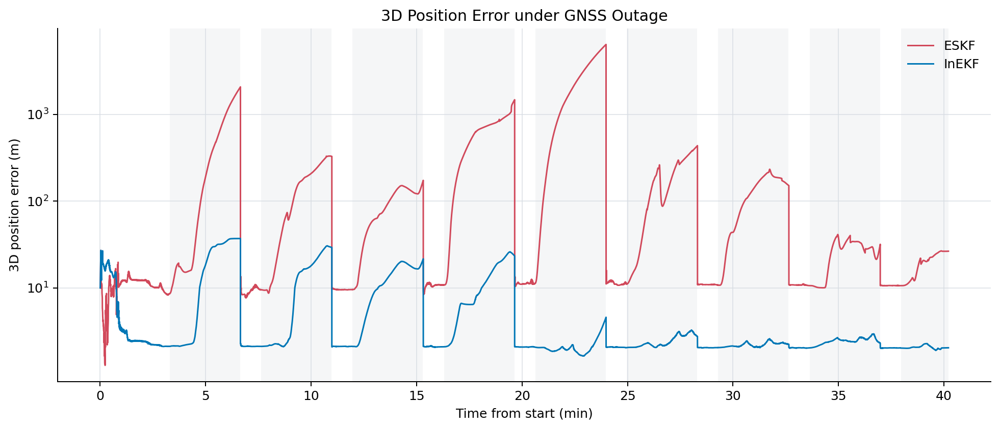
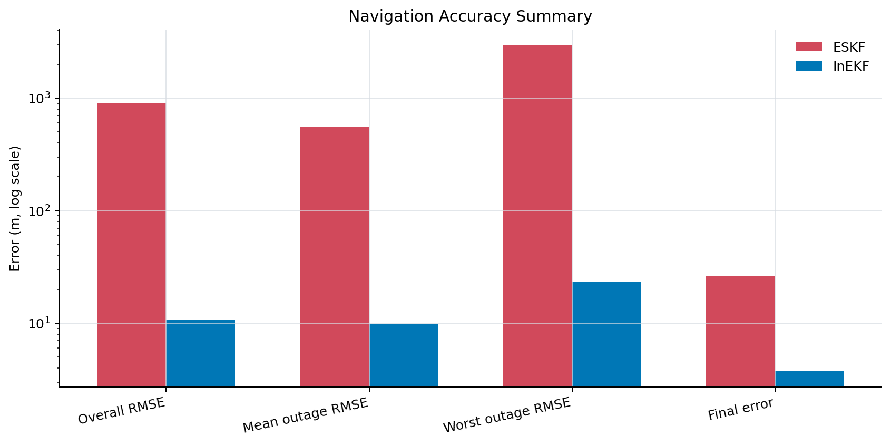
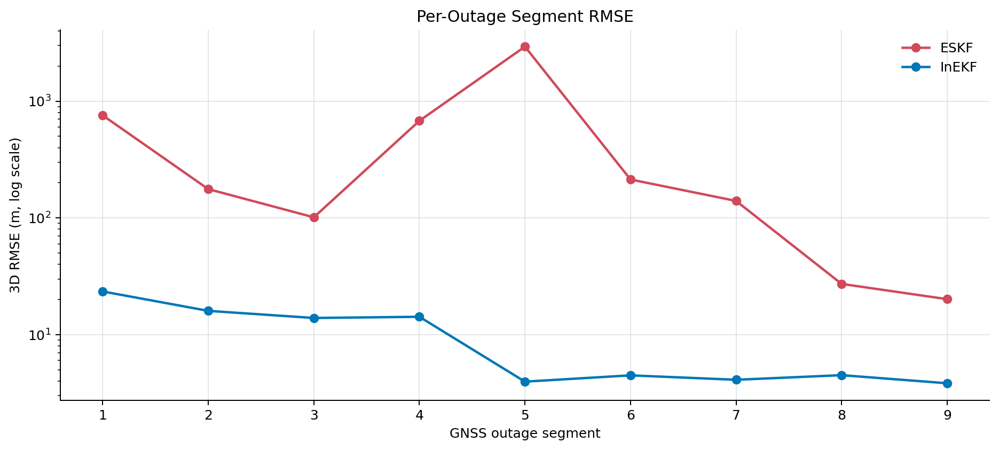
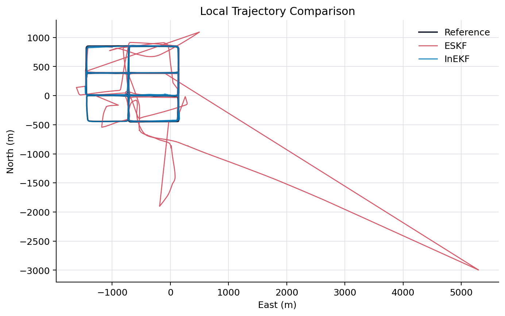
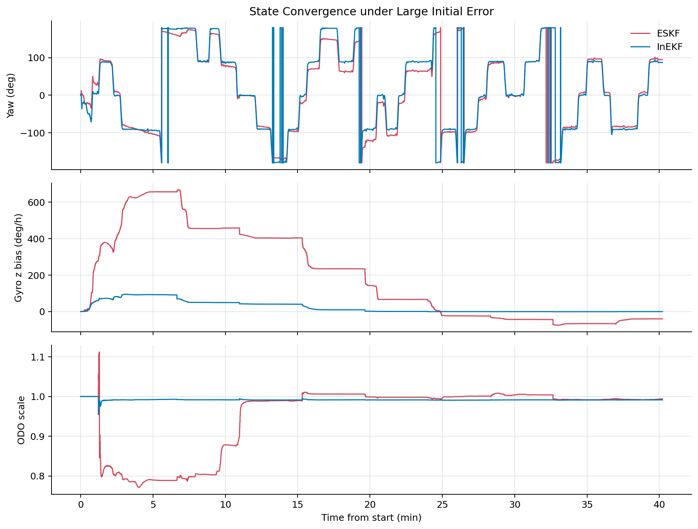

# Combined INS Navigation

[中文说明](README_CN.md)

This repository implements a C++17 integrated navigation pipeline for
`INS/GNSS/ODO/NHC` fusion. The main experiment compares a conventional
Error-State Kalman Filter (ESKF) with an invariant-error variant (InEKF) under
periodic GNSS outage and deliberately poor initial conditions.

The project is intended as a compact, portfolio-ready navigation engineering
case study: IMU mechanization, GNSS updates, odometer forward-speed constraints,
non-holonomic constraints, online calibration states, and ESKF/InEKF comparison
are all implemented in one reproducible code path.



## Highlights

- **Multi-sensor fusion**: IMU propagation with GNSS position/velocity,
  odometer (ODO), non-holonomic constraint (NHC), optional UWB and ZUPT updates.
- **ESKF and InEKF comparison**: the same measurement pipeline can run with
  standard ESKF process semantics or InEKF process/reset semantics.
- **31-state estimation**: position, velocity, attitude, IMU biases, IMU scale
  factors, ODO scale, mounting angles, ODO lever arm, and GNSS lever arm.
- **GNSS outage evaluation**: periodic GNSS availability windows are configured
  directly in YAML and evaluated by outage segment.
- **Robust update controls**: NIS gating, robust weighting, covariance floors,
  runtime phase controls, and diagnostic logs.

## Method Overview

```text
IMU increments
    -> nominal INS propagation
    -> ESKF / InEKF error-state prediction
    -> GNSS position / velocity update
    -> ODO forward-speed update
    -> NHC lateral / vertical velocity update
    -> error injection, reset, diagnostics, and result export
```

The core distinction in the showcased experiment is the process/reset model.
Both filters receive the same IMU, GNSS, ODO, and NHC data. Under a large
initial attitude and position error, the InEKF setting converges much more
reliably during GNSS outage intervals.

## Experiment

The showcased `data2` experiment uses:

- INS/GNSS/ODO/NHC fusion
- Periodic GNSS outage: repeated 200 s outage windows after the initial
  alignment/calibration stage
- Large initial error: position offset, zero initial velocity, zero initial
  attitude, and zero initial lever-arm/mounting guesses
- Two filter modes:
  - `configs/data2_ins_gnss_odo_nhc_eskf_large_initial_error.yaml`
  - `configs/data2_ins_gnss_odo_nhc_inekf_large_initial_error.yaml`

| Method | Overall 3D RMSE (m) | Mean outage RMSE (m) | Worst outage RMSE (m) | Final 3D error (m) |
|---|---:|---:|---:|---:|
| ESKF | 908.583 | 560.468 | 2932.327 | 26.436 |
| InEKF | 10.836 | 9.819 | 23.426 | 3.785 |









## Repository Layout

```text
apps/
  eskf_fusion_main.cpp       # main fusion executable
  data_converter_main.cpp    # raw IMU/reference conversion utility
  uwb_generator_main.cpp     # optional UWB range generator

include/
  app/                       # configuration, dataset, runtime, diagnostics APIs
  core/                      # compatibility wrappers and UWB helpers
  navigation/                # filter state, process models, measurement models
  io/, utils/                # text I/O and coordinate/math utilities

src/
  app/                       # config parser, initialization, scheduler, runtime
  navigation/                # ESKF/InEKF process and measurement implementation
  core/, io/, utils/

configs/                     # showcased ESKF/InEKF experiment configs
scripts/                     # plotting, asset generation, and data conversion
assets/                      # README figures and metric summary
docs/                        # concise technical notes
```

## Build

The project uses CMake, Eigen 3.4, and yaml-cpp 0.8. Dependencies are fetched
through CMake `FetchContent`.

```bash
cmake -S . -B build -DCMAKE_BUILD_TYPE=Release
cmake --build build --config Release
```

Main executable:

```bash
./build/eskf_fusion --config configs/data2_ins_gnss_odo_nhc_inekf_large_initial_error.yaml
```

On Windows/MSVC, the executable is usually under `build/Release/`.

## Data

Large navigation datasets and generated solver outputs are not committed to
this repository. The showcase configs expect the following local data layout:

```text
dataset/
  data2_converted/
    IMU_converted.txt
    ODO_converted.txt
    POS_converted.txt
  data2/
    rtk.txt
```

The plotting assets in `assets/` were generated from two completed experiment
runs with the script below:

```bash
python scripts/analysis/make_readme_assets.py
```

That script reads the ESKF/InEKF result directories placed next to this
repository and regenerates the README figures plus `assets/metrics_summary.csv`.

## Output Format

`eskf_fusion` writes a whitespace-separated `SOL_*.txt` file with 31 columns:

```text
timestamp
fused_x fused_y fused_z
fused_vx fused_vy fused_vz
fused_roll fused_pitch fused_yaw
mounting_pitch mounting_yaw odo_scale
sg_x sg_y sg_z
sa_x sa_y sa_z
ba_x ba_y ba_z
bg_x bg_y bg_z
lever_x lever_y lever_z
gnss_lever_x gnss_lever_y gnss_lever_z
```

Position and velocity are stored in ECEF. Attitude is exported as NED Euler
angles in degrees.

## Author

Zhang Changfan  
GitHub: [zhang123-1999](https://github.com/zhang123-1999)  
Email: <zzchangfan@gmail.com>
